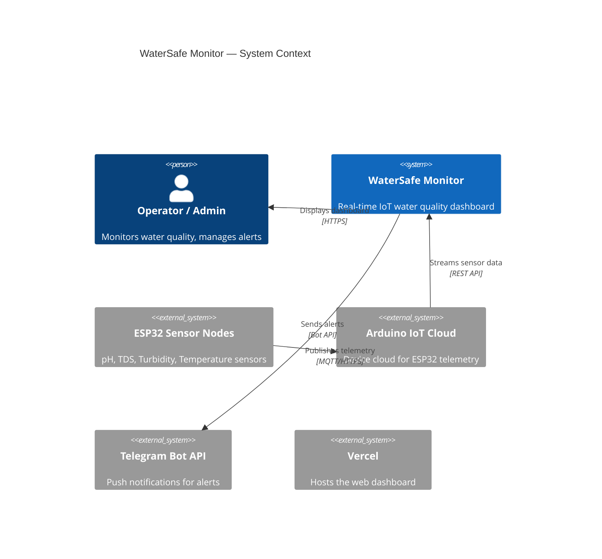
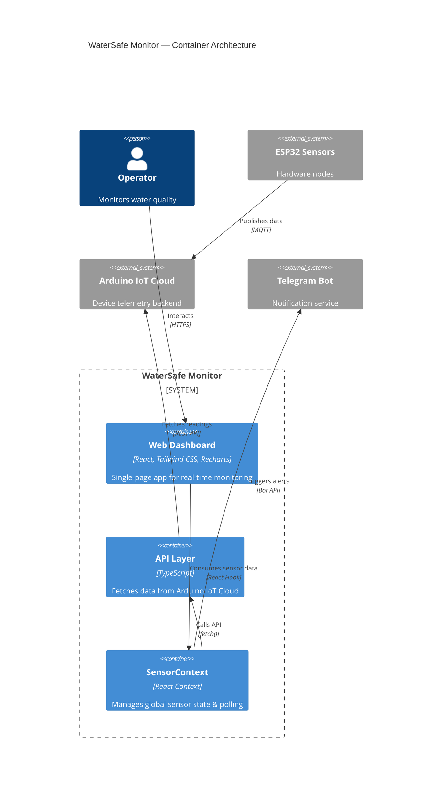
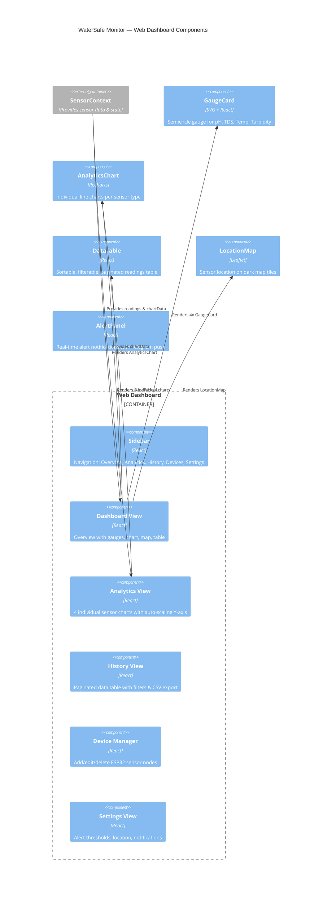
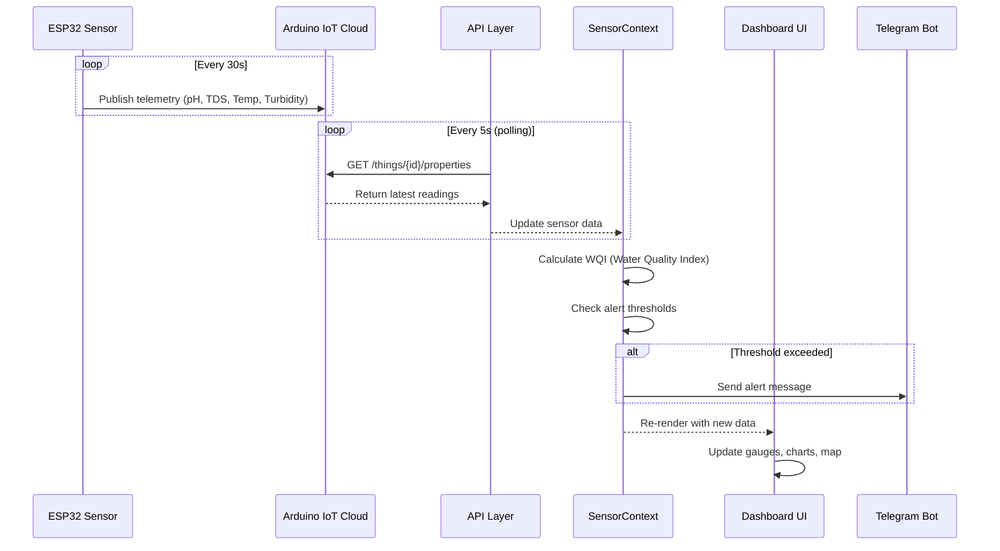
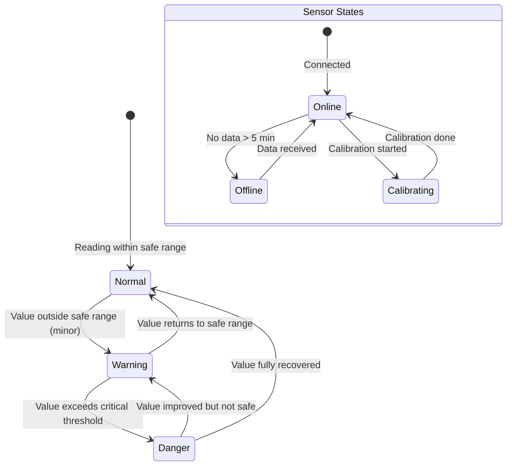
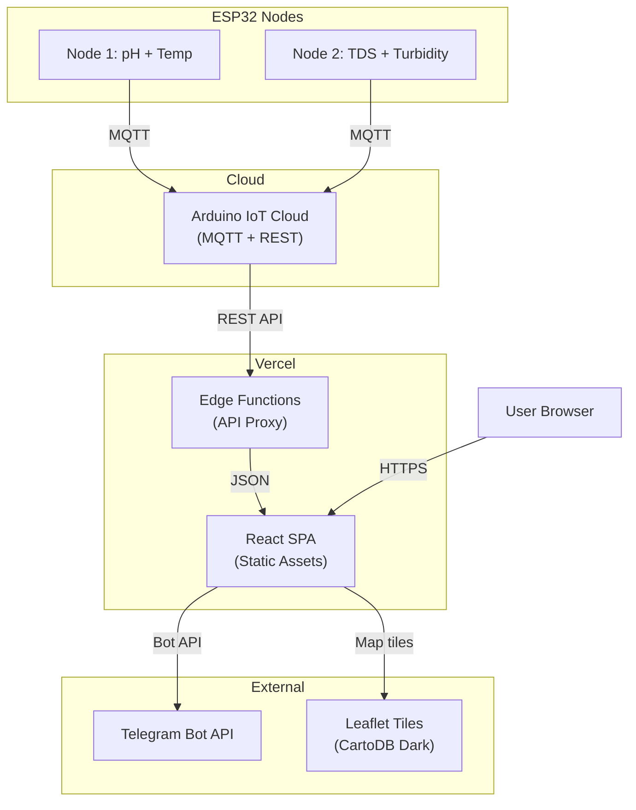
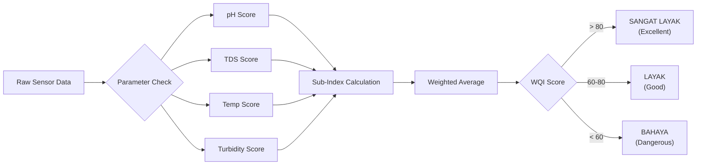

# WaterSafe Monitor — System Architecture

> C4 Model + Data Flow diagrams for the IoT Water Quality Monitoring System.

## 1. Context Diagram (Level 1)

## 2. Container Diagram (Level 2)

## 3. Component Diagram (Level 3) — Web Dashboard

## 4. Data Flow — Sensor to Dashboard

## 5. State Machine — Sensor Status

## 6. Deployment Architecture

## 7. WQI Calculation Flow

## Design Decisions

| Decision | Choice | Rationale |
|----------|--------|-----------|
| Frontend | React + Tailwind CSS | Fast development, utility-first styling |
| Charts | Recharts | React-native, composable, good for dashboards |
| Map | Leaflet + CartoDB Dark | Free, dark tiles match theme, lightweight |
| State | React Context + useReducer | Simple for single-page IoT dashboard |
| Polling | 5s interval | Balance between real-time & API rate limits |
| Hosting | Vercel | Auto-deploy, edge functions, free tier |
| Alerts | Telegram Bot API | Free, reliable, instant push notifications |
